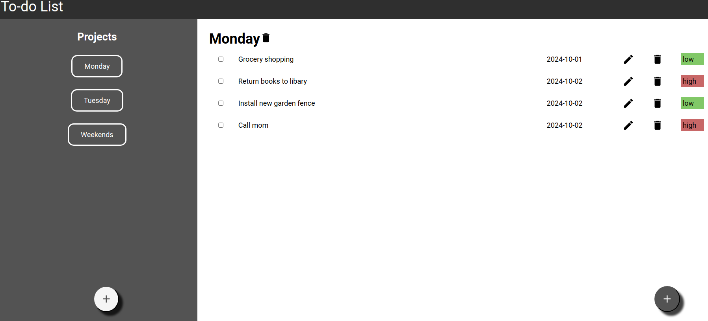

# To-do-list / odin-todo-list

A web version of to-do-list where data is stored at browser. Created with html, css, javascript

## Live demo
- https://wongyc-66.github.io/odin-battleship/

## Tech stack 
- html, css, javascript

## Source
- https://wongyc-66.github.io/odin-Todo-list/

## Installation
1. npm install
2. npm run start, or npm run build (access output file at /dist)

